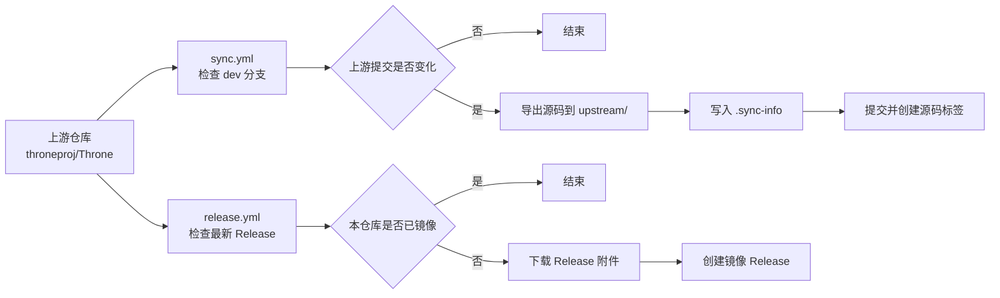

<div align="center">

# throne-mirror

Throne 上游仓库的源码与 Release 文件镜像

[](https://github.com/throneproj/Throne)
[](https://github.com/throneproj/Throne/tree/dev)
[](https://github.com/hopol/throne-mirror/actions/workflows/sync.yml)
[](https://github.com/hopol/throne-mirror/actions/workflows/release.yml)
[](LICENSE)
[](https://github.com/throneproj/Throne/blob/dev/LICENSE)

[上游仓库](https://github.com/throneproj/Throne) · [镜像 Releases](https://github.com/hopol/throne-mirror/releases) · [Actions](https://github.com/hopol/throne-mirror/actions)

</div>

---

## 📌 说明

本仓库用于镜像 [`throneproj/Throne`](https://github.com/throneproj/Throne) 的源码和 GitHub Release 文件。

- 源码来自上游 `dev` 分支，导出到 `upstream/`。
- Release 文件来自上游最新 GitHub Release，并重新发布到本仓库的 Releases。
- 本仓库不修改上游源码，不重新构建二进制文件，也不提供 Throne 的官方支持。

> [!NOTE]
> Throne 是基于 Qt 的跨平台桌面代理工具，上游项目说明为 “Qt based Desktop cross-platform GUI proxy utility, empowered by Sing-box”。如需确认功能、安装方式、更新内容或安全信息，请查看上游仓库。

## 📁 镜像范围

| 内容 | 位置 | 说明 |
|---|---|---|
| 上游源码 | `upstream/` | 通过 `git archive` 从上游 `dev` 分支导出。 |
| 同步信息 | `upstream/.sync-info` | 记录上游提交、同步时间、分支和版本号。 |
| 源码标签 | `mirror-source-v{版本}-{短提交}` | 对应一次源码同步。 |
| Release 文件 | 本仓库 Releases | 下载自上游 GitHub Release。 |
| Release 标签 | `mirror-release-{上游标签}` | 对应一个上游 Release。 |

## 🔄 自动同步

本仓库包含两个 GitHub Actions 工作流：



| 工作流 | 文件 | 默认时间（UTC） | 用途 |
|---|---|---:|---|
| 同步源码 | `.github/workflows/sync.yml` | 02:00 | 检查上游 `dev` 分支，发现新提交后更新 `upstream/`。 |
| 镜像 Release | `.github/workflows/release.yml` | 02:37 | 检查上游最新 Release，发现未镜像的版本后下载附件并创建本仓库 Release。 |

两个工作流都支持在 Actions 页面手动运行。

> [!IMPORTANT]
> GitHub Actions 中的定时任务使用 UTC 时间。当前 cron 表达式的日期字段为 `*/5`，实际运行日期通常是每月 1、6、11、16、21、26、31 日，不等同于严格每 5 天运行一次。

## 🧾 同步信息

每次源码同步后，`upstream/.sync-info` 会写入类似内容：

```ini
commit=0123456789abcdef...
timestamp=2026-08-07T00:00:00Z
upstream_url=https://github.com/throneproj/Throne
upstream_branch=dev
version=0.1
```

字段说明：

| 字段 | 含义 |
|---|---|
| `commit` | 上游 `dev` 分支的提交哈希。 |
| `timestamp` | 同步时间，UTC。 |
| `upstream_url` | 上游仓库地址。 |
| `upstream_branch` | 同步分支。 |
| `version` | 从上游 `CMakeLists.txt` 的 `project(Throne VERSION ...)` 读取。 |

同步脚本会先读取已提交的 `.sync-info`，再判断上游提交是否变化。只有提交不同才会更新 `upstream/` 并创建新的提交和标签。

## 💻 本地同步源码

`sync.sh` 可用于本地手动同步源码。它不会处理 Release 文件。

### 要求

- Git；
- Bash 环境，例如 Linux、macOS、WSL 或 Git Bash；
- 能访问 GitHub；
- 如需推送结果，需要对本仓库有写入权限。

### 使用方式

```bash
git clone https://github.com/hopol/throne-mirror.git
cd throne-mirror
chmod +x sync.sh
./sync.sh
```

脚本主要步骤：

1. 确认或添加 `upstream` 远程；
2. 拉取上游 `dev` 分支和标签；
3. 对比上次记录的上游提交；
4. 如有变化，重新导出 `upstream/`；
5. 写入 `.sync-info`，提交变更，创建并推送源码镜像标签。

### 同步配置

脚本顶部的相关配置：

```bash
UPSTREAM_URL="https://github.com/throneproj/Throne.git"
UPSTREAM_WEB_URL="https://github.com/throneproj/Throne"
UPSTREAM_BRANCH="dev"
MIRROR_REPO="https://github.com/hopol/throne-mirror"
```

如果修改同步来源或分支，请同时检查 GitHub Actions 工作流中的对应变量。

## 🚀 Release 镜像

`release.yml` 会读取上游最新 Release，并按下面的规则创建本仓库 Release：

- 本仓库标签名：`mirror-release-{上游标签}`；
- Release 标题包含上游 Release 名称；
- Release 说明中包含上游 Release 链接和上游原始说明；
- 附件直接来自上游 Release 下载结果。

> [!WARNING]
> 本仓库不会校验、重签名或重新打包这些附件。下载和使用前请自行确认来源、版本和文件完整性。

## 🛠️ 维护常用命令

```bash
# 查看远程仓库
git remote -v

# 查看当前镜像对应的上游提交
git show HEAD:upstream/.sync-info

# 列出镜像标签
git tag -l 'mirror-*'

# 手动拉取上游 dev 分支
git fetch upstream dev --tags
```

## ❓ 常见问题

| 问题 | 处理方式 |
|---|---|
| Actions 无法推送提交或标签 | 检查仓库 Settings → Actions → General 中的 Workflow permissions，确保 `GITHUB_TOKEN` 有写入权限。 |
| 定时任务没有准时运行 | GitHub scheduled workflow 可能延迟，且时间按 UTC 计算。 |
| 获取不到上游分支 | 确认上游仍然存在 `dev` 分支，并检查网络访问。 |
| Release 创建失败 | 查看 Actions 日志，重点检查 GitHub API、`GITHUB_TOKEN` 权限和上游 Release 附件下载结果。 |
| 源码同步每次都产生提交 | 检查 `upstream/.sync-info` 是否已提交，以及工作流是否在删除 `upstream/` 前读取旧记录。 |

## ⚖️ 许可证

本仓库包含两部分内容，许可证不同：

| 内容 | 许可证 |
|---|---|
| 本仓库编写的脚本、工作流和文档 | [MIT License](LICENSE) |
| `upstream/` 中镜像的 Throne 源码 | 上游 [GPL-3.0](https://github.com/throneproj/Throne/blob/dev/LICENSE) |
| 上游 Release 附件和第三方组件 | 以对应上游项目、附件和依赖的许可证为准。 |

Throne 及其相关组件的具体许可证、第三方资源条款和使用限制，请以上游仓库为准。

---

<div align="center">

本仓库只是镜像，不是 Throne 官方仓库。

[返回顶部](#throne-mirror)

</div>
